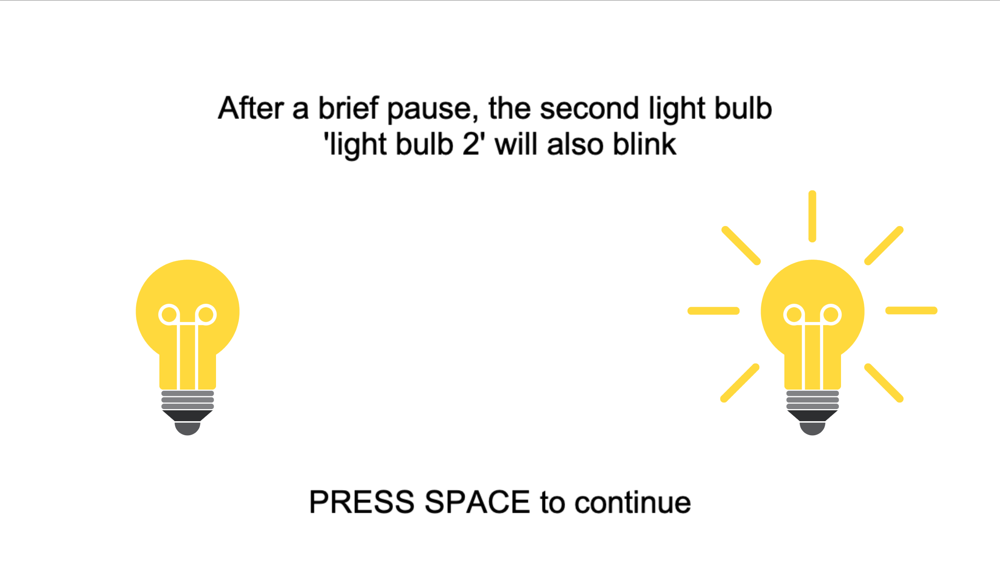
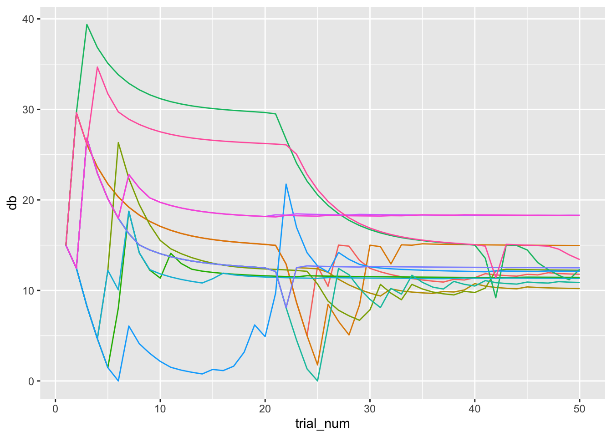

# Auditory Tone Detection Task (forked)
 

This is a modified version of the Open Source Auditory Tone Detection Task experiment developed by Jason He, with modifications and corrections made by Lowe Wilsson for running the experiment at Karolinska Institutet. The original version/repository can be found [here](https://github.com/HeJasonL/Open-source-Auditory-Tone-Detection-Task). The experiment is created with [PsychoPy](https://psychopy.org/).

## Experiment outline
In the experiment, participants go through 50 trials (this can be reconfigured). In each trial, the participant is shown two light bulbs, one on the left-hand side and one on the right-hand side. The light bulbs both light up, one at a time. At the same time as one of the light bulbs lights up, a tone is played. The participant is then asked to indicate (with keyboard keys '1'/'2') if the tone was played as the left or right bulb lit up. Throughout the experiment, the tone volume is increased/decreased based on the participant's performance.

At experiment startup, one may choose to activate 'masking', where a noise is played simultaneously ('Simultaneous') with the target tone, or directly after ('Backward') the target tone. One may also choose to not use any masking ('Quiet').

Task difficulty (tone volume) is updated based on the QUEST algorithm/method (Watson & Pelli, 1983).

## Running the experiment
1. Install [Standalone PsychoPy](https://www.psychopy.org/download.html).
2. Download this project, by either using the green 'code' button and selecting 'Download ZIP', or by using `git clone` if you know Git.
3. Open up e.g. 'pure_tone_detection.psyexp' with PsychoPy.
4. Click the cogwheel ('Edit experiment settings') icon, go to the 'Screen' tab, and insert specifications appropriate for your monitor(s) (if you haven't already, you also need to do setup in Monitor Center - please see the [PsychoPy documentation](https://www.psychopy.org/)).
5. Click the Play ('Run experiment') icon.

You will also need to change experiment configurations, e.g. the size of stimuli or number of trials. The number of trials is set in the 'welcome' routine's 'welcome_code' code component, while other configurations are made directly through the various PsychoPy components that are used.

## Pre-experiment calibration
Note that, for this experiment to run correctly, it is _absolutely necessary_ that you first run the Headphone Calibration PsychoPy 'experiment'. This calibration 'experiment' is included in the [GitHub code repository](https://github.com/AnonZebra/Open-source-Auditory-Tone-Detection-Task) (see the subdirectory 'Headphone Calibration'). The calibration should result in a value that's used, roughly, to inform PsychoPy what volume setting on the computer corresponds to producing 60dB sound through the physical speakers. This experiment extrapolates from the calibration information to produce sound at correct volumes.

Once you've run the Headphone Calibration 'experiment' and have a calibration value:
1. Open up 'pure_tone_detection.psyexp'.
2. Click the cogwheel icon.
3. In the 'Basic' tab, under 'Experiment info', update the 'Calibration' value.

_Note_: If you have an anechoic chamber or similar very well isolated testing environment, you can likely achieve better accuracy by using a lower (e.g. 25dB) calibration volume. If you wish to do this, you need to replace all references to 60dB in this experiment as well as the Headphone Calibration 'experiment'. This is unfortunately a bit of a hassle, as such references are spread throughout the experiments.

## Translating the experiment
All experiment instructions are specified in a code component.

1. Open 'pure_tone_detection.psyexp'.
2. Go to the 'welcome' routine.
3. Open up the 'translation_code' component.
4. In the 'Before experiment' tab, insert your translations. (make sure to leave the apostrophes `''` and parentheses `()`).
    - You can find examples of translations in the 'translations' subdirectory.

Once you've finished translating the experiment, save it ('Save current experiment file' in main window toolbar) and try running it again.

## Output data
The most relevant output data files are the 'CSV'/'.csv' files, saved to the 'data' directory. The most important columns in these files are as follows:

* Trial: Trial number
    - _Note_ that the 'practice trials' are also given trial numbers 0-5, then trial counting restarts from 1 for the 'real' trials.
* Desired_dB: The decibel (dB) that was 'intended' to be played by PsychoPy for the corresponding trial.
    - In order to ensure that the physically produced volume corresponds to desired dB values, the experiment relies on a correct audio calibration/configuration of the experiment having been done (see 'Pre-experiment calibration').
* key_resp_trial.corr: indicates whether participant response was 'correct', 'incorrect', or there was 'no response' (for 'baseline' blocks, this column holds a 'baseline' value).

If you use R, you might be interested in the RMarkdown document 'data_analysis/atdt_db_trends_analysis.Rmd', which includes code for collecting all participants' dB values in a single data frame and visualizing participants' dB trends. An example of what this visualization can look like is shown below.

 

## Corrections
Corrections to the experiment setup and procedure were made based on general information on audiometrics/audiometry and information in the official [PsychoPy book](https://uk.sagepub.com/en-gb/eur/building-experiments-in-psychopy/book253480) regarding staircase procedures, specifically the QUEST staircase.

Notably, in the 'questConditionsFile.xlsx' file (which holds staircase specifications used by the experiment), the 'startVal', 'startValSd' and 'pThreshold' are quite different from what is specified in the original (He's) version of this experiment. The PsychoPy book says about these values:

> * startVal: this is your initial guess of what the threshold might be
> * startValSd: this is your initial guess as to the spread of the psychometric function
> * pThreshold: this is the threshold value that you want to home in on, expressed as a fraction (e.g. 0.8 for an 80% threshold target)

According to e.g. [Wikipedia](https://en.wikipedia.org/wiki/Absolute_threshold_of_hearing), 0dB is " approximately the quietest sound a young human with undamaged hearing can detect at 1,000 Hz". Thus, one's 'initial guess' for participants' auditory thresholds (at least in the 'Quiet' condition) ought to be relatively close to 0dB. Accounting for participants being of various ages with e.g. varying degrees of damaged hearing, and the testing environment at Karolinska Institutet not being perfectly quiet, the 'startVal' in this version is set to 15dB, and the startValSd to 18dB. Corresponding values in the original version of the experiment are 60/24dB.

The 'pThreshold' value is much less straight-forward of a concept, but was set to 0.82 for this experiment based on recommendations in the PsychoPy book (and relevant literature - though at the time of writing, I cannot recall the sources I looked at). The original version has a pThreshold value of 0.63.

You might wish to tweak the 'questConditionsFile.xlsx' values based on how good the sound isolation in the testing environment is, and whether you wish to focus on pure auditory threshold ('Quiet' condition) measurement or on trials with masking ('Simultaneous'/'Backwards').

## Attribution
As mentioned above, this is a modified version of an experiment that was developed by Jason He while working in Nicolaas Puts research group at King’s College London. The code repository for this modified version can also be found [on GitHub](https://github.com/AnonZebra/Open-source-Auditory-Tone-Detection-Task). Modifications were made by Lowe Wilsson, while working for Janina Neufeld at Karolinska Institutet. As of yet, no article describing the experiment has been published. In the meantime, if you use this modified version in a study, please include links to both the [original](https://github.com/HeJasonL/Open-source-Auditory-Tone-Detection-Task) and this modified version's code repositories.

## Error reporting
If you notice any problems with the experiment even after following the instructions above for configuration et c., please create a GitHub issue on this project's [repository](https://github.com/AnonZebra/Open-source-Auditory-Tone-Detection-Task).

## References
Watson, A. B., & Pelli, D. G. (1983). Quest: A Bayesian adaptive psychometric method. Perception & Psychophysics, 33(2), 113–120. https://doi.org/10.3758/BF03202828
